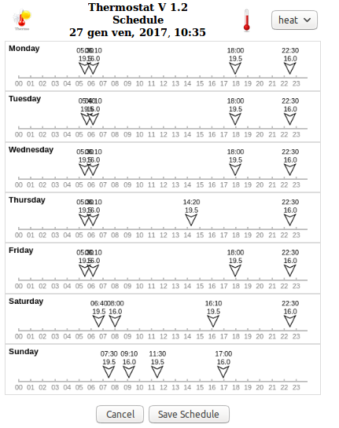

# Raspberry Pi Thermostat Implementation

Author: 	Jpnos
Email:		jpnos at gmx dot com
License:	MIT

**THE SOFTWARE IS PROVIDED "AS IS", WITHOUT WARRANTY OF ANY KIND, EXPRESS OR IMPLIED, INCLUDING BUT NOT LIMITED TO THE WARRANTIES OF MERCHANTABILITY,
FOR A PARTICULAR PURPOSE AND NONINFRINGEMENT. IN NO EVENT SHALL THE AUTHORS OR COPYRIGHT HOLDERS BE LIABLE FOR ANY CLAIM, DAMAGES OR OTHER
LIABILITY, WHETHER IN AN ACTION OF CONTRACT, TORT OR OTHERWISE, ARISING FROM, OUT OF OR IN CONNECTION WITH THE SOFTWARE OR THE USE OR OTHER DEALINGS IN THE
SOFTWARE.**

-----------------------------------------------------------------------------------------------------------------------------------------

This project is a fairly comprehensive implementation of a Thermostat for a Raspberry Pi Zero , designed to run on 3.5" Touch Sensitive LCD screen. 

Key features include:

	1. Touch senstive thermostat display/control for 3.5" Touch Sensitive LCD screen.
	2. Schedule support, including daily schedules for Heat and Dht_Logger
	3. Built in web interface/server to enable control of thermostat and edit schedule remotely through any browser (including touch-sensitive iOS devices)
	4. Today weather forecasts using openweathermap.org
	5. The implementation will run on non-Pi linux machines (eg. Ubuntu) for testing purposes, using simulated GPIO and a fixed current temperature
	6. Battery backup (optional)
	7. Supports Celcius (default) or Farenheit
	8. Supports calibration of your temperature sensor
	9. Minimal UI (screensaver) mode
	10. Detailed logging with selectable levels, including graph of data
	11. Security Access to web interface not implemented due the use of remot3.it
	12. Use of Dht_Logger as Temperature Sensor located in other cold room wifi connected
	

###Thermostat User Interface

**Thermostat UI on Touch Screen:**

**Thermostat min UI - Settings:**

**Thermostat Web UI - Settings:**

**Thermostat Web UI - Edit Schedule:**

**Note**: *Double click/tap on a blank space in the schedule to create a new entry*

**Thermostat Graph:**

**Thermostat Dht Web:**

**Thermostat Hardware - Internals:**

The author's final internals, before the case top was installed.

**Thermostat Installation:**

 You can see the temperature sensor in a separated place in the own printed box.

##Hardware (as used/tested by author):

	- Raspberry Pi Zero
	- WiFi Adapter 150 Mbps
	- SunFounder Lab Module 2 Relè 5V
	- WINOMO DS18B20 Weatherproof temperature sensor
	- Elegoo 3.5 Inch  Touchscreen Display
	- Custom 3d abs printed thermostat enclosure

##Software Requirements (as used/tested by author):

	- Latest Raspbian OS
	- Python 2.7
	- Kivy (Ver 1.9.2 dev) UI framework
	- kivy garden
	- kivy garden-knob
	- Additional required python packages:
	    - w1thermsensor
	    - FakeGPIO (for testing on non-Pi platforms, customized version included)
	    - CherryPy (web server)
	    - schedule (for scheduled events)
	    - openweathermap.org app key
	- Remote3 Weaved 
	- Fbcp (copy hdmi source on spi)
		

##Software installation:

	1. Make sure you have the latest Raspbian updates
	2. Install Kivy on your Pi using the instructions found here: http://www.kivy.org/docs/installation/installation-rpi.html
	3. Install additional python packages: CherryPy, schedule,kivy-garden & w1thermsensor using the command "sudo pip install ..."
	4. Install knob with garden: "sudo garden install knob"
	5. Get an openweathermap.org app key if you don't have one from here: http://www.openweathermap.org/appid
	6. Edit the thermostat_settings.json file and insert your Open Weather Map app key in the appropriate spot. Also change the location to your location.
	7. Configure on thermostat_settings.json for your Gpio and your Set
	8. Install weaved : sudo apt-get install weavedconnectd then sudo weavedinstaller (follow instruction : http://forum.weaved.com/t/how-to-get-started-with-remot3-it-for-pi/1029)
	9. Install fbcp : https://github.com/watterott/RPi-Display/blob/master/docu/FAQ.md

##DH_Logger
DHT_Logger is a Esp8266-Dht22 sensor temperature wifi connected.
	
	It's installed in the coldest room and Thermostat can use it as temperature sensor.
	It's possible to Install Thermostat everywhere and check the coldest temperature in the home and react to this sensor
	2 schedule possible 
		1 for dht
		1 for Heat (sensor inside Thermostat)
	So it's possible to have two temperature and two schedule for sensor and in case DHT_Logger in unavailable, Thermostat switch to internal and the correct schedule/temperature.
	You can switch between dht and sensor pressing area of Set visualization

##Hardware Configuration:

The software comes configured to use the following default GPIO pins:

	GPIO 4  - Temperature sensor
	GPIO 27 - Heat (Furnace) relay control
	GPIO 18 - Fan relay control
 
If you wish to use different pins, then change the appropriate values in the thermostat_settings.json file. 

The author used a Raspberry Pi Zero for his thermostat. 

##How USE:
	Heat/Dht :	Schedule change temperature as set on file
		change temp on knob remain on the temperature till a schedule change it
		
	Hold :	Temp remains on set temp (change with knob)
	
	No Hold No Heat : set temp to Ice Preserve (set Temperature on Json Setting file)

##Temperature Sensor Calibration:

The implementation supports calibration of your DS18B20 temperature sensor, following the method outlined here: https://learn.adafruit.com/calibrating-sensors/two-point-calibration

If you want to calibrate your DS18B20 (you should be using a weatherproof sensor if you want to do calibration!), then find out your elevation (meters or feet, depending on which measurement 
system you are using), measure the temperature in an ice bath and in boiling water, and change the elevation and measured freezing/boiling points in the thermostat_settings.json file.

The default values in the thermostat_settings.json file(s) effectively do no correction, so you can leave them alone if you don't want to calibrate your temperature sensor.

 
##Running the Thermostat Code: 

You can run the code as follows:

	sudo python thermostat.py

You need sudo since the code accesses the Pi GPIO pins, which requires root priviledges

To have the thermostat code start automatically at boot time, 
 - sudo crontab -e 
 - add:   @reboot /home/pi/thermostat/autostart.sh
 - save and close
 - sudo reboot now

To access the Web-based interface to control the thermostat and change the schedule, just point your favourite browser at the IP address that your Pi board is set to. For example, the author's thermostat is on 10.66.66.30, so entering http://10.66.66.30 will bring up the web interface. The Web Interface is touch sensitive on IOS devices. If you bring up the Web Interface on Safari on an IOS device (iPhone/iPad), you can save it to your home page, and it will use a nice thermostat icon.

From internet acces follow instruction on weaved site

##Minimal UI (screensaver) mode: 

The Minimal UI (screensaver) mode is enabled by default. This mode will just show the current temperature, greyed out after a specified timeout. To restore the full UI, just touch the screen anywhere. You can disable this in the in the thermostat_settings.json file. Default timeout to display the minimal UI is 1 minute, and can be changed in the in the settings file as well.

You can optionally attach a PIR motion sensor and use that to switch back to full UI mode when motion is detected. Use of a PIR sensor is disabled by default. You can enable the PIR sensor in the thermostat_settings.json file.
If you are using the PIR Motion Sensor, you can also specify a From/To time range (HH:MM for each) during which you wish to ignore any sensed motion, in effect, making you touch the screen to show the full UI during the specified time period. Default settings are not to ignore the PIR Motion Sensor ever (eg. From/To both set to "00:00").  This was a feature request from the boss (wife!), so that the display would not switch to the full UI in the wee hours when she gets up to go to the bathroom. 

##Logging:

This implementation is fully instrumented with logging capabilities. Logging channel (destination) and level are set in the thermostat_settings.json file.

Available logging channels include:

	none  - no logging
	file  - log to thermostat.log file (default)
	print - log to sysout

Logging levels include:

	error - Only log error conditions
	state - Log thermostat state changes only (eg. temperature change, system status changes, etc.) (default)
	info  - Log detailed information/settings (this logs a lot of information!)
	debug - Log debug information (this logs a lot of stuff!)

Each logging level includes those above it in the list, for example: info level logging also enables state and error logging entries. 

Default logging is set to log to a file with level: state.

##Credits
Thanks to [chaeron ] (https://github.com/chaeron) who is the developer of this forked git 

Thanks to [Jeff - The Nooganeer](http://www.nooganeer.com/his/category/projects/homeautomation/raspberry-pi-thermostat/), who's blog posts got me started in the right direction for the hardware needed for this project.
 

And finally, thanks to [Nich Fugal/Makeatronics](http://makeatronics.blogspot.com/2013/06/24v-ac-solid-state-relay-board.html) for his great 24V AC Solid State Relay Board.

##Additional Notes/Comments:
 
1. Default temperatures are in degrees Celcius, a righteous metric scale. If you wish to configure the thermostat to use the Farenheit system, you will need to replace 
   the .json config files with those in the resources/farenheit directory.

2. Future versions may include smart capabilities supporting remote wireless temperature sensors, log analysis, security/authentication and more. But don't hold your breath...

3. Feel free to hack the code, so long as you credit the source. It is assumed that if you do, you have some familiarity with programming, python, web coding and the like.

4. You are welcome to ask questions about the implementation and to offer suggestions to the author. 

Enjoy!

....Athos

	
